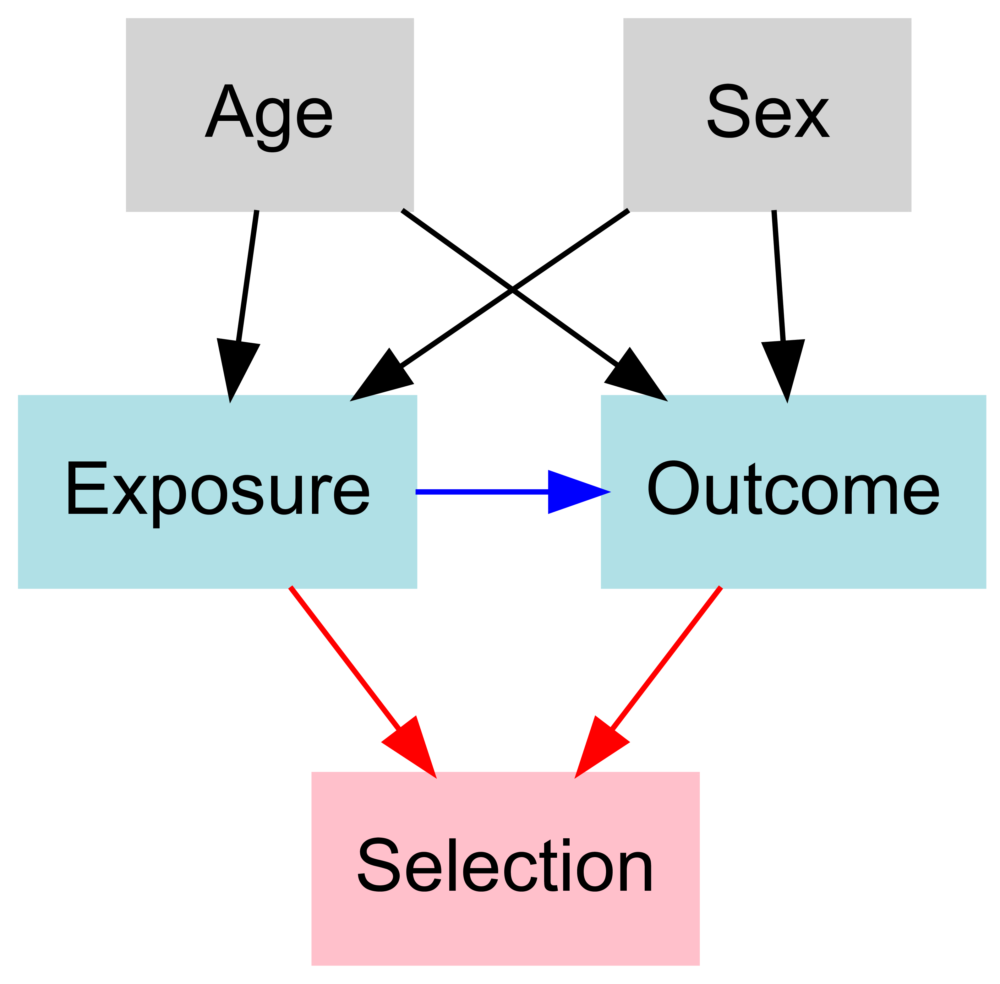

# Description

R function for drawing a DAG (directed acyclic graph). Though similar R functions or packages exist, they require specification of the DAG using knowing [dot](https://graphviz.org/) (Graphviz) or [Mermaid](https://github.com/mermaid-js/mermaid). In comparison, this function requires specification of the DAG using R objects.

# Dependencies

- *DiagrammeR*

# Use

Define the nodes, as a list. The list should contain one or more character vector, with named elements. Each character vector defines a row in the desired DAG. For example:

```r
nodes<-list(
  c(
    age='Age',
    sex='Sex'
  ),
  c(
    x='Exposure',
    y='Outcome'  
  ),
  c(
    selection='Selection'
  )
)
```

Here, there are 3 character vectors, indicating we want 3 rows. The first character vector defines two nodes, `age` and `sex`, with the display names "Age" and "Sex."

Define the arrows as a list. The list should contain one or more character vector. Each character vector defines an arrow. For example:

```r
arrows<-list(
  c('x','y','blue'),
  c('age','x'),
  c('age','y'),
  c('sex','x'),
  c('sex','y'),
  c('x','selection','red'),
  c('y','selection','red')
)
```

The first character vector defines an arrow that begins from `x` and ends with `y`, and will be `blue`. A full list of possible colors is available [here](https://graphviz.org/doc/info/colors.html).

Define node colors as a list, with named elements. The list should contain one or more character vector. For example:

```r
node_colors<-list(
  powderblue=c('x','y'),
  pink='selection'
)
```

The first element indicates that we want `x` and `y` to be `powderblue`.

To draw the DAG:

```r
draw_a_dag(nodes,arrows,node_colors)
```

The resulting image is:



Unfortunately, the underlying function does not work with cairo_pdf(). To export to PDF, use the *DiagrammeRsvg* and *rsvg* packages:

```r
rsvg_pdf(charToRaw(export_svg(draw_a_dag(nodes,arrows,node_colors))),'example.pdf')
```
